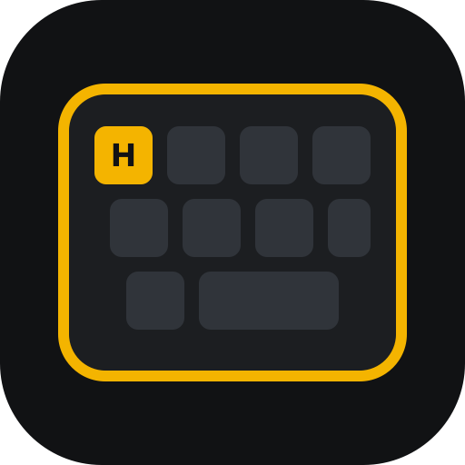

<p align="center">
  
</p>

# Hyper Keyboard

Hyper Keyboard is a personal Raycast extension that turns configured Hyper shortcuts into a visual macOS keyboard. It combines the latest local Raycast settings snapshot with an Obsidian Canvas and optional JSON overrides, while keeping every source read-only.

## What it does

- Renders a full keyboard image with app icons, empty keys, and conflict badges.
- Provides a searchable Raycast list with shortcut details and source metadata.
- Resolves installed Raycast extension titles and icons from their local manifests.
- Imports labels, notes, and images from the existing Hyper keyboard Canvas.
- Highlights stale Raycast snapshots instead of presenting old data as current.
- Supports explicit JSON overrides for shortcuts configured in other applications.

## Run locally

Requirements: macOS, Raycast, Node.js 22 or newer, and npm.

```bash
npm install
npm run dev
```

Raycast opens the extension in development mode. Use either command:

- `Show Hyper Keyboard` for the visual global keyboard.
- `Browse Hyper Shortcuts` for search, details, source files, and conflict inspection.

When Browse has nothing to list — no assigned keys with **Show unassigned keys** off, or a search that matches nothing — Raycast shows an empty state with the next step: open Extension Preferences to turn unassigned keys on, add a Hyper shortcut, or try another query.

## Data sources

Sources are merged in this order:

1. **Obsidian Canvas** adds labels, notes, icons, and shortcuts configured outside Raycast.
2. **Raycast snapshot** confirms global `⌃⌥⇧⌘` bindings and supplies installed app or extension icons.
3. **Custom JSON** replaces a key by default, or appends when `replace` is `false`.

The extension auto-detects the local Raycast settings snapshot directory when it exists:

```text
~/Library/Application Support/com.raycast.macos/cloud-sync/settings-snapshots/
```

Canvas is not auto-detected. Set Preferences → Canvas File to import one. A personal vault path such as `~/oldwinter-notes/Atlas/Canvas/快捷键键盘布局/键盘快捷键映射图 - Hyper - macOS.canvas` is only an example.

Every other path can be overridden in Raycast Preferences. Raycast does not expose a public API for enumerating global command hotkeys, so the extension deliberately reads the newest cloud-sync snapshot rather than depending on the private live database. Snapshot age is shown as a warning.

## Custom JSON

Start from [examples/hyper-shortcuts.example.json](examples/hyper-shortcuts.example.json):

```json
{
  "version": 1,
  "shortcuts": [
    {
      "key": "Q",
      "title": "Open Cubox",
      "description": "Shortcut configured outside Raycast",
      "appPath": "/Applications/Cubox.app"
    },
    {
      "key": "Space",
      "title": "Raycast Notes",
      "icon": "📝",
      "replace": false
    }
  ]
}
```

`icon` accepts an emoji, an HTTPS URL, or a path relative to the JSON file. `appPath` uses the installed application's Finder icon.

## Privacy

Shortcut data stays local. The extension only reads the files selected in Preferences. Public image URLs already present in the Canvas are downloaded into Raycast's extension support directory so they can appear in the generated keyboard; no configuration is uploaded.

## Development

```bash
npm test          # focused parser, merge, and renderer tests
npm run typecheck # strict TypeScript
npm run lint      # Raycast manifest, ESLint, and Prettier
npm run build     # production Raycast bundle
npm run preview   # render the current local keymap outside Raycast
```
